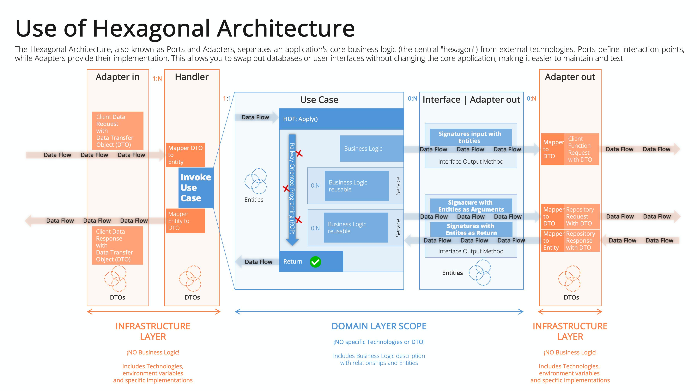

# Architecture

This document provides an overview of the application's architecture, vendor extensibility, and the transaction hash verification flow.

## Hexagonal Architecture

This project is built following Domain-Driven Design (DDD) principles and a Hexagonal Architecture to ensure a clean separation between the core business logic and external infrastructure concerns.

The primary goals of this architecture are:
- **Isolation of Business Logic:** The core domain is independent of any specific framework or technology.
- **Extensibility:** New features, adapters, or vendors can be added with minimal changes to the core application.
- **Testability:** The separation of concerns makes the application easier to test at different levels (unit, integration, e2e).

<p align="center">
  
</p>
<p align="center">
  
</p>

### Key Strengths:

*   **Excellent Separation of Concerns:** The project strictly adheres to the principles of hexagonal architecture, ensuring that the core business logic in the `domain` is completely decoupled from external technologies and frameworks. This makes the application highly adaptable and easy to test.
*   **Well-Organized Adapters:** The `src/adapter` directory is a textbook example of how to structure inbound and outbound adapters. The `in` and `out` subdirectories, further organized by protocol (`http`) and external service (`firestore`, `postgres`), make the code easy to navigate and understand.
*   **Scalable Vendor Integration:** The pattern established for integrating with external vendors is robust and scalable. It provides a clear blueprint for adding new integrations while maintaining a consistent and organized codebase.

## Infrastructure Design

The infrastructure is designed for scalability, reliability, and maintainability, using modern cloud-native technologies.

### Technology Stack

-   **Application:**
    -   **Framework:** NestJS
    -   **Language:** TypeScript
    -   **Runtime:** Node.js
-   **Infrastructure & Deployment:**
    -   **Cloud Provider:** Google Cloud Platform (GCP)
    -   **Infrastructure as Code (IaC):** Terraform
    -   **Containerization:** Docker
    -   **Container Orchestration:** Google Kubernetes Engine (GKE)
-   **CI/CD:**
    -   **Automation:** GitHub Actions

### CI/CD Security

The CI/CD pipeline is designed with a security-first approach, leveraging Google Cloud's Workload Identity Federation to establish a trust relationship between GitHub Actions and GCP. This method avoids the use of static, long-lived service account keys, significantly improving the security posture.

-   **Keyless Authentication:** Instead of storing a service account key as a GitHub secret, the workflow obtains a short-lived access token from GCP based on a trusted identity.
-   **Least Privilege:** The impersonated service account is granted the minimum necessary permissions to perform its tasks (e.g., pushing to Artifact Registry and deploying to GKE).

### Repository Structure

The repository is organized to reflect the Hexagonal Architecture, with a clear separation between the `domain` and `infrastructure` layers.

```
.
├── .github/                # CI/CD workflows and PR templates
├── domain/                 # Core business logic (independent of frameworks)
│   └── src/
│       ├── common/         # Shared constants and variables
│       ├── interface/      # Contracts for repositories and external services
│       ├── model/          # Business entities and data types
│       └── usecase/        # Application-specific business rules
├── infrastructure/         # Infrastructure as Code (Terraform)
├── k8s/                    # Kubernetes manifests (deployment, service, etc.)
├── src/                    # NestJS application layer (infrastructure and adapters)
│   ├── app.module.ts       # Root application module
│   ├── main.ts             # Application entry point
│   ├── payments.module.ts  # Main module for the payments domain
│   ├── adapter/
│   │   ├── in/http/        # Inbound adapters (REST API controllers)
│   │   └── out/            # Outbound adapters (database, external APIs)
│   │       ├── firestore/  # Firestore database adapter
│   │       ├── postgres/   # TypeORM (Postgres) adapter
│   │       └── vendors/    # Adapters for external payment vendors
│   ├── common/             # Shared utilities, filters, and interceptors
│   ├── handler/            # CQS handlers to orchestrate use cases
│   └── model/              # DTOs, enums, and other data structures
├── Dockerfile
└── README.md
```

## Vendor Extensibility

One of the most significant advantages of this architecture is its extensibility. Adding a new vendor to the platform is a straightforward process that requires minimal effort.

To add a new vendor, a developer simply needs to follow these steps:

1.  **Create a New Vendor Directory:** Inside `src/adapter/out/vendors`, create a new directory for the new vendor (e.g., `src/adapter/out/vendors/new-vendor`).

2.  **Implement the Vendor Controller:** Create a new controller class (e.g., `new-vendors.controller.ts`) that contains the logic for making the external API call. This controller will be responsible for handling the specifics of the vendor's API, such as the endpoint URL, authentication, and request/response formats.

3.  **Define DTOs:** Create Data Transfer Objects (DTOs) to define the request and response data structures for the new vendor. This ensures type safety and a clear contract for the data being exchanged.

4.  **Register the Controller:** In the `payments.module.ts` file, add the new vendor controller to the `providers` array. This will make the controller available for dependency injection throughout the application.

By following this pattern, new vendors can be added to the platform without modifying any of the core business logic. This makes the system highly modular, scalable, and easy to maintain.

## Transaction Hash (txhash) Verification Flow

The `txhash` is a critical piece of information that allows for the verification of a transaction on the blockchain. The verification flow is as follows:

1.  **Receive the `txhash`:** The client sends a `POST` request to the `/transfer` endpoint with the `txhash` in the request body.
2.  **Vendor Interaction:** The application interacts with the specified vendor's API to initiate the off-ramp process.
3.  **Asynchronous Verification:** In a production scenario, a separate, asynchronous process would be triggered to verify the `txhash`. This could be a message queue (e.g., Google Pub/Sub) that a worker service subscribes to.
4.  **Blockchain Interaction:** The worker service would then use a blockchain explorer API (e.g., Etherscan for Ethereum) or a direct connection to a blockchain node to query the transaction details using the `txhash`.
5.  **Verification Checks:** The worker would perform several checks, such as:
    *   Confirming that the transaction was successful.
    *   Verifying that the "to" address is the correct company wallet.
    *   Ensuring that the transaction amount and token type (e.g., USDC) are correct.
6.  **Update Transaction Status:** Based on the verification results, the worker would update the transaction status in the database to "verified" or "failed".