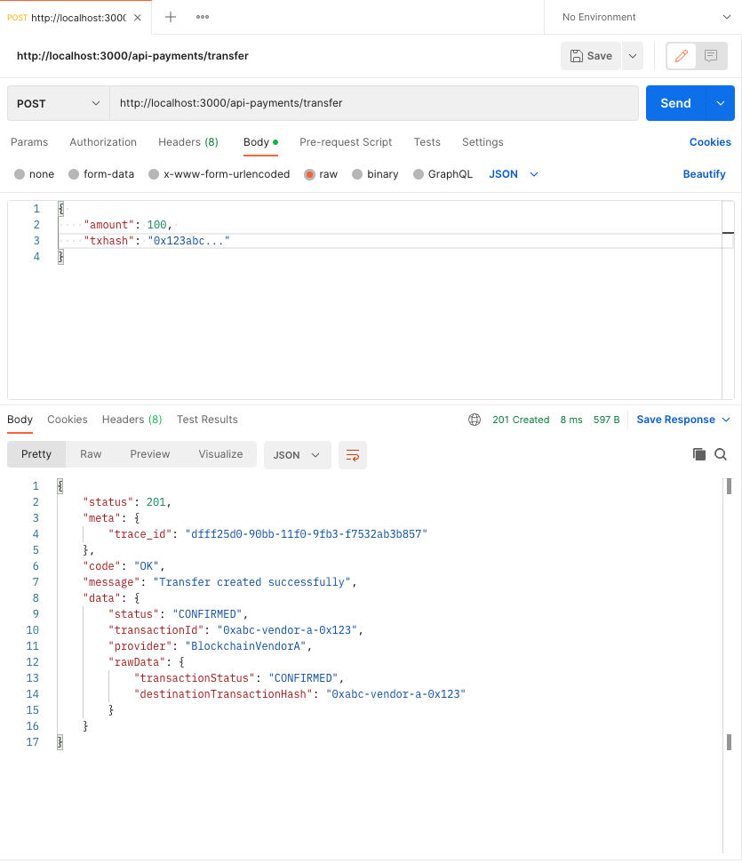
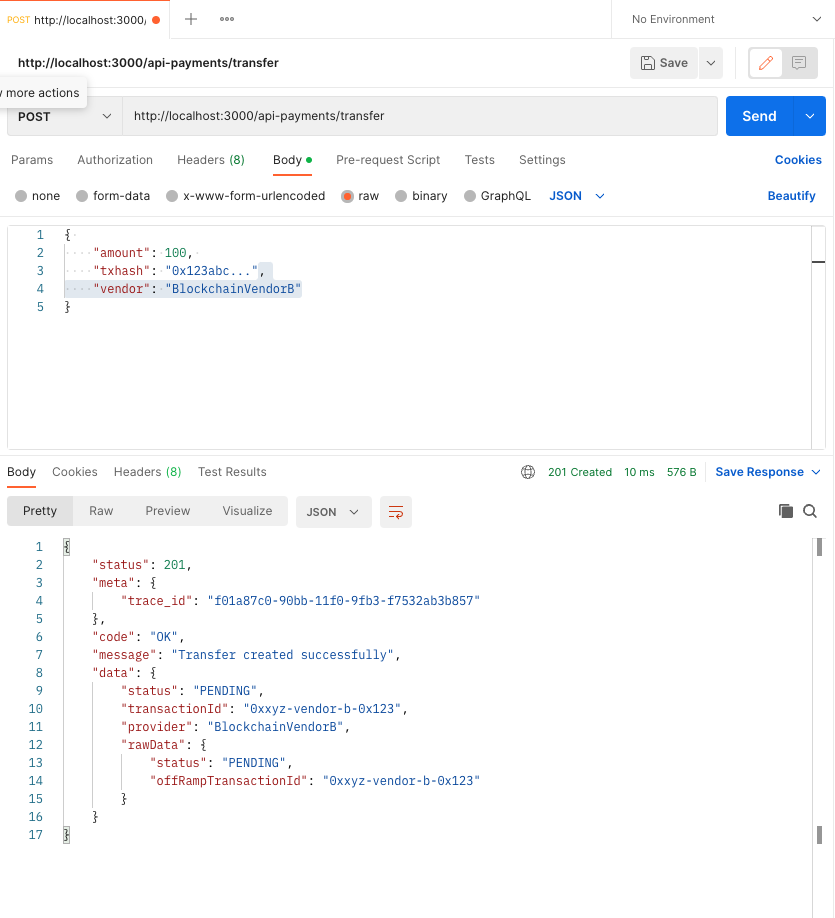

<p align="center">
  <a href="https://github.com/javialej/KiraTakeHomeTest/actions/workflows/ci-cd.yml"></a>
</p>

<p align="center">
  A production-ready, cross-border payments API built with NestJS, Hexagonal Architecture, and a secure, automated infrastructure on Google Cloud.
</p>

<p align="center">
  <a href="https://www.npmjs.com/~nestjscore" target="_blank"></a>
  <a href="https://www.npmjs.com/~nestjscore" target="_blank"></a>
  <a href="https://github.com/google/gts" target="_blank"></a>
  <a href="https://sonarcloud.io/summary/new_code?id=kira-take-home-test" target="_blank"></a>
</p>

---

## About This Project

This repository contains a robust and extensible cross-border payments API designed for high performance and security. The initial implementation handles USDC to COP (Colombian Peso) transfers, integrating with multiple off-ramp vendors and verifying each transaction via its `txhash`.

The project's primary focus is on **infrastructure, observability, automation, and security**, providing a solid, SOC 2-aligned foundation for a scalable payments service.

-   **Architecture**: [Hexagonal (Ports & Adapters)](./ARCHITECTURE.md) for a clean separation of concerns.
-   **Infrastructure**: Fully automated with Terraform on **Google Cloud Platform (GCP)**.
-   **CI/CD**: Automated build, test, and deployment pipelines using **GitHub Actions**.
-   **Security**: Secure, keyless authentication between CI/CD and GCP using **Workload Identity Federation**.

## Table of Contents

- [Running the Application Locally](#running-the-application-locally)
- [Testing](#testing)
- [Project Structure](#project-structure)
- [CI/CD Pipelines](#cicd-pipelines)
- [Further Documentation](#further-documentation)

---

## Running the Application Locally

You can run the application locally using Docker, which ensures a consistent and isolated environment.

### Prerequisites

-   [Docker](https://www.docker.com/get-started) must be installed and running on your machine.
-   You must have a `.env` file. You can create one by copying the example:
    ```bash
    cp .env.example .env
    ```

### Step 1: Build and Run the Container

This project includes a `docker-compose.yml` file to simplify the local setup.

```bash
docker-compose up --build
```

This command will:
1.  Build the Docker image for the application.
2.  Start the container in the foreground, so you can see the application logs.
3.  Make the API available at `http://localhost:3000`.

### Step 2: Send a Test Request

Once the application is running, you can test the primary endpoint using a tool like `curl`. This example simulates a transfer of 100 USDC.

```bash
curl -X POST \
  http://localhost:3000/api-payments/transfer \
  -H 'Content-Type: application/json' \
  -d '{ "amount": 100, "txhash": "0x123abc..." }'
```

### Expected Response

A successful request will return a `201 Created` status. The system uses amount-based routing:
-   No specify a Blockchain vendor it will be routed to `BlockchainVendorA` and return a `CONFIRMED` status.
-   Specify a Blockchain vendor B it will be r to `BlockchainVendorB` and return a `PENDING` status.

**Vendor A Response:**
```json
{
    "meta": { "trace_id": "..." },
    "code": "OK",
    "message": "Transfer created successfully",
    "data": {
        "status": "CONFIRMED",
        "transactionId": "0xabc-vendor-a-...",
        "provider": "BlockchainVendorA",
        "rawData": {
            "transactionStatus": "CONFIRMED",
            "destinationTransactionHash": "0xabc-vendor-a-..."
        }
    }
}
```


**Vendor B Response:**
```json
{
    "meta": { "trace_id": "..." },
    "code": "OK",
    "message": "Transfer created successfully",
    "data": {
        "status": "PENDING",
        "transactionId": "0xxyz-vendor-b-...",
        "provider": "BlockchainVendorB",
        "rawData": {
            "status": "PENDING",
            "offRampTransactionId": "0xxyz-vendor-b-..."
        }
    }
}
```


### Step 3: Cleanup

To stop and remove the containers and network created by Docker Compose, simply press `Ctrl+C` in the terminal where the container is running, or run the following command from the project root:

```bash
docker-compose down
```

---

## Testing

The project has a comprehensive suite of unit tests.

-   **Run all tests:**
    ```bash
    npm test
    ```
-   **Run tests with coverage report:**
    ```bash
    npm run test:cov
    ```

### Code Coverage

| File                                                          | % Stmts | % Branch | % Funcs | % Lines |
| ------------------------------------------------------------- | ------- | -------- | ------- | ------- |
| **All files**                                                 | **98.98** | **76.08** | **100** | **98.83** |
| domain/src/common                                             | 100     | 100      | 100     | 100     |
| domain/src/model                                              | 100     | 100      | 100     | 100     |
| domain/src/usecase                                            | 100     | 100      | 100     | 100     |
| src/adapter/in/http                                           | 100     | 77.27    | 100     | 100     |
| src/adapter/in/http/dto                                       | 100     | 100      | 100     | 100     |
| src/adapter/out/blockchainVendors                             | 100     | 80       | 100     | 100     |
| src/adapter/out/blockchainVendors/blockchainVendorA           | 100     | 75       | 100     | 100     |
| src/adapter/out/blockchainVendors/blockchainVendorA/dto       | 100     | 100      | 100     | 100     |
| src/adapter/out/blockchainVendors/blockchainVendorB           | 100     | 75       | 100     | 100     |
| src/adapter/out/blockchainVendors/blockchainVendorB/dto       | 100     | 100      | 100     | 100     |
| src/adapter/out/firestore                                     | 92.85   | 66.66    | 100     | 91.66   |
| src/adapter/out/postgres                                      | 94.11   | 60       | 100     | 93.1    |
| src/common/logger                                             | 100     | 60       | 100     | 100     |
| src/common/metrics                                            | 100     | 100      | 100     | 100     |
| src/common/response-states                                    | 100     | 100      | 100     | 100     |
| src/common/utils                                              | 100     | 100      | 100     | 100     |
| src/handler                                                   | 100     | 78.57    | 100     | 100     |
| src/model/dto                                                 | 100     | 100      | 100     | 100     |
| src/model/enum                                                | 100     | 100      | 100     | 100     |
| src/model/exceptions                                          | 100     | 100      | 100     | 100     |
| src/model/mapper                                              | 100     | 100      | 100     | 100     |

---

## Project Structure

The repository is organized to reflect the Hexagonal Architecture, with a clear separation between the `domain` (core business logic), `infrastructure` (cloud resources), and `k8s` (application deployment) layers.

```
.
├── .github/                # CI/CD workflows
├── domain/                 # Core business logic (framework-agnostic)
├── infrastructure/         # Terraform code for core GCP resources (GKE, VPC, etc.)
├── k8s/                    # Kubernetes manifests for the application (deployment, service, ingress)
├── src/                    # NestJS application layer (adapters, controllers, etc.)
├── ...
└── README.md
```

---

## CI/CD Pipelines

The project uses two distinct GitHub Actions workflows to safely separate infrastructure management from application deployment.

### 1. Infrastructure Pipeline (`infrastructure.yml`)

This workflow is responsible for provisioning the core cloud infrastructure.

-   **What it does**: Runs `terraform apply` to create the GKE Cluster, VPC, Subnets, and the global static IP address for the Ingress.
-   **Trigger**: Manual execution only (`workflow_dispatch`).
-   **How to Run**:
    1.  Navigate to the **Actions** tab in GitHub.
    2.  Select the **Infrastructure CI/CD** workflow.
    3.  Click **Run workflow**, choosing the target environment (`development` or `production`).
    4.  The `plan` job will run, showing you the proposed changes.
    5.  **Approve the `apply` job** to proceed with the infrastructure changes.
-   **When to run**: You should run this once to set up an environment, or when you need to make changes to the core infrastructure (e.g., modifying the GKE cluster or VPC settings).

### 2. Application CI/CD Pipeline (`ci-cd.yml`)

This workflow is responsible for building and deploying the application to an existing cluster.

-   **What it does**: Builds a Docker image, pushes it to the Artifact Registry, and deploys it to the GKE cluster using `kubectl`.
-   **Triggers**: Runs automatically on every push to `main` or `feature/*` branches.
-   **Deployment Flow**:
    1.  **CI**: Runs linting and unit tests.
    2.  **Build & Push**: Builds a new Docker image tagged with the commit SHA.
    3.  **Deploy**:
        *   Creates/updates a Kubernetes secret (`app-secrets`) with the latest application configuration from GitHub Secrets.
        *   Applies the Kubernetes manifests from the `/k8s` directory (`deployment.yaml`, `service.yaml`, `ingress.yaml`).
        *   Updates the running deployment to use the newly built Docker image.
    4.  **Manual Approval**: Deployments to the `production` environment (triggered by a push to `main`) require manual approval before the `deploy_prod` job will run.

### CI/CD Configuration and Secrets

For the pipelines to run, you must configure your GCP project and add the following secrets to your GitHub repository.

#### Required Secrets

-   `GCP_PROJECT_ID`: The unique ID of your Google Cloud project.
-   `DB_HOST`: The hostname or IP address of the database server.
-   `DB_PORT`: The port number of the database server.
-   `DB_USERNAME`: The username for the database connection.
-   `DB_PASSWORD`: The password for the database connection.
-   `DB_NAME`: The name of the database.
-   `SERVICE_NAME`: The name of the service (e.g., `kira-payments`).
-   `COLLECTION_NAME`: The name of the Firestore collection.

#### How to Add Secrets to GitHub

1.  **Navigate to your GitHub Repository:**
    Open your web browser and go to your repository's main page.

2.  **Go to Settings:**
    Click on the **Settings** tab in the main navigation bar.

3.  **Access Actions Secrets:**
    In the left sidebar, navigate to **Secrets and variables** > **Actions**.

4.  **Add Each Secret:**
    Click the **New repository secret** button. Enter the secret's name (e.g., `DB_HOST`) in the "Name" field and paste its value in the "Secret" field. Click **Add secret** and repeat this process for all the required secrets listed above.

---

## Automated Triggers

This project provides methods for external scripts or agents to perform key actions.

### Triggering a Transfer Request

An external agent can initiate a transfer by sending a `POST` request to the `/api-payments/transfer` endpoint.

-   **URL**: `http://<your-service-url>/api-payments/transfer`
-   **Method**: `POST`
-   **Body**:
    -   `amount` (number): The amount to transfer.
    -   `txhash` (string): The transaction hash for verification.
    -   `vendor` (string, optional): The specific vendor to use (e.g., `BlockchainVendorA`). If omitted, the system will route based on the amount.

**Example using `curl`:**

```bash
curl -X POST \
  http://localhost:3000/api-payments/transfer \
  -H 'Content-Type: application/json' \
  -d '{ "amount": 100, "txhash": "0x123abc...", "vendor": "BlockchainVendorA" }'
```

### Deploying a New Vendor Service

To streamline the process of adding a new payment vendor, this project includes a custom NestJS schematic. This generator automatically scaffolds all the necessary files and updates the application module.

**Usage:**

1.  **Run the Schematic**: From the root of the project, run the `nest generate` command, passing the new vendor's name in PascalCase (e.g., `VendorC`).

    ```bash
    nest generate vendor VendorC
    ```
    This creates a new directory at `src/adapter/out/blockchainVendors/vendor-c` with boilerplate files.

2.  **Implement the Logic**: Open the newly created controller file and implement the vendor-specific transfer logic.

3.  **Add the Routing Logic**: Open `src/adapter/out/blockchainVendors/blockchainVendors.controller.ts` and add the new vendor to the routing logic. For example, to make `VendorC` selectable by name, you would add it to the `switch` statement:

    ```typescript
    // src/adapter/out/blockchainVendors/blockchainVendors.controller.ts

    // ... inside the BlockchainVendorsController class ...
    private getVendor(
      amount: number,
      vendor?: keyof typeof BlockchainVendors,
    ): IVendors {
      if (vendor) {
        switch (vendor) {
          case BlockchainVendors.BlockchainVendorA:
            return this.vendorA;
          case BlockchainVendors.BlockchainVendorB:
            return this.vendorB;
          // Add your new vendor here
          case BlockchainVendors.BlockchainVendorC: // <-- Add this line
            return this.vendorC;                   // <-- And this line
          default:
            throw new NotFoundException('Vendor not found');
        }
      }
      // ... rest of the amount-based routing logic
    }
    ```
    *(Remember to also inject the new `BlockchainVendorCController` in the constructor of `BlockchainVendorsController`)*

4.  **Commit and Push**: Once you have implemented and tested the logic, commit the new files and push them. The CI/CD pipeline will automatically deploy the updated application with the new vendor.

---

## Further Documentation


-   [**Architecture Deep Dive**](./ARCHITECTURE.md): A detailed explanation of the hexagonal architecture, infrastructure design, CI/CD configuration.
-   [**SOC 2 Alignment**](./SOC2.md): A description of how the infrastructure and processes align with SOC 2 principles.
